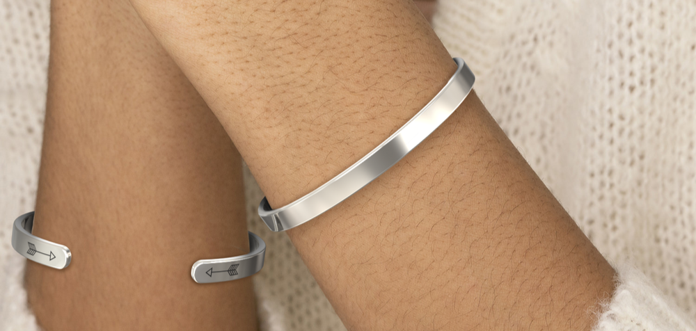

# Recuerda Quién Eres — Pulsera Personalizable



Landing page para venda de pulseiras personalizadas com gravação. Design elegante e minimalista com as cores marfim, ameixa, verde e dourado.

## 🛠 Tecnologias

- HTML5
- CSS3 (custom properties, flexbox, grid)
- JavaScript vanilla (interações de personalização)

## 📁 Estrutura

```
recuerda-tu-corona/
├── index.html              # Página principal da landing page
├── assets/
│   └── images/             # Imagens do produto e demonstrações
├── README.md
└── .gitignore
```

## 🚀 Como usar

1. Clone o repositório:
   ```bash
   git clone https://github.com/emaildaloja31-arch/recuerda-tu-corona.git
   ```
2. Abra o arquivo `index.html` no navegador.

## 🌐 GitHub Pages

Este projeto pode ser publicado diretamente via GitHub Pages:
- Acesse **Settings → Pages**
- Selecione a branch `main` e a pasta raiz `/`
- O site ficará disponível em `https://emaildaloja31-arch.github.io/recuerda-tu-corona/`

---

Feito com ❤️ para celebrar quem você é.
